# Zetten Release Flow (Visual Guide)

```mermaid
graph TD
    A["Feature Branch"] -->|1. Push & Merge PR| B["Main Branch"]
    B -->|2. Run 'Bump Version' Action| C["Release PR"]
    C -->|3. Merge PR| D["Main Branch (Updated)"]
    D -->|4. Push Git Tag vX.Y.Z| E["🚀 RELEASE PIPELINE"]
    E --> F["PyPI"]
    E --> G["GitHub Binaries"]
    E --> H["crates.io"]
```



## Step 1: Finish your work
1. **Push** your feature branch to GitHub.
2. **Open a PR** into `main`.
3. **Merge** it once approved.

## Step 2: Prepare the Version
1. Go to **Actions** -> **Bump Version & Tag** in GitHub.
2. Click **Run workflow** (choose `patch`, `minor`, or `major`).
3. This creates a **Release PR**.
   - The version number is in the PR title (e.g., `Release v1.1.0`).
   - **Review and Merge this PR manually**. It is not merged automatically so you can verify the version numbers are correct.

## Step 3: Launch the Release
Now that `main` has the new version number, you just need to "fire the flare". The exact commands are **provided for you in the PR description** you just merged:

```bash
git checkout main
git pull
git tag v1.1.0        # Use the version from the PR title
git push origin v1.1.0
```

## Step 4: Watch the magic
The **Release** workflow starts automatically. It will:
1. Build and upload to **PyPI**.
2. Create the **GitHub Release** and upload binaries.
3. Publish to **crates.io**.
4. Run a **Smoke Test** to make sure it works.

---
**Why two PRs?**
The first PR is for your code changes. The second PR (automated) is just to update the version numbers in `Cargo.toml` and `pyproject.toml` so your git history stays clean.
